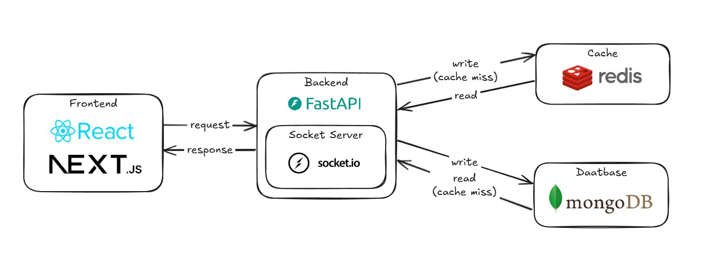
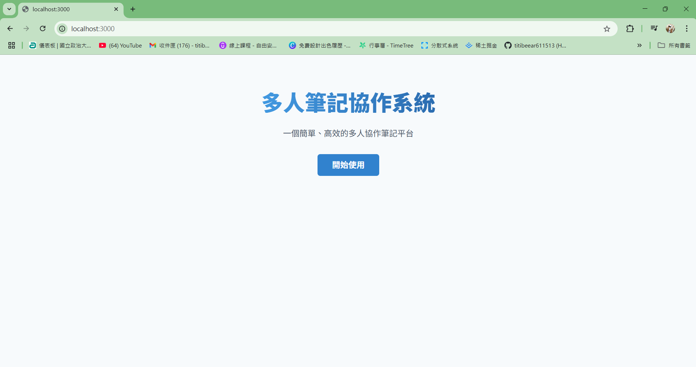
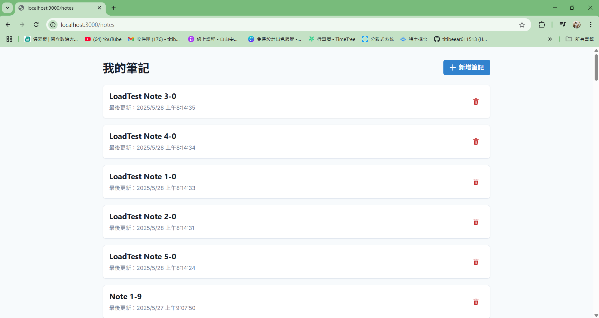

# **SyncNote**
A collaborative note-taking project that enables real-time synchronization among multiple users.
## System Architecture  


## Main Feature
```
1. 使用者認證
2. 筆記的創建、編輯和刪除
3. 即時協作編輯
```

## 功能展示

### 1. 登入頁面：
#### - 點擊開始使用進入系統主頁面


### 2. 筆記列表頁面：
#### - 進來系統主頁面，顯示所有之前新增的筆記


### 3. 創建新筆記：
#### - 點擊右上角的新增筆記，輸入筆記標題


### 4. 筆記操作：
#### - 點擊筆記列進入共編筆記，或點選delete icon刪除筆記


### 5. 筆記編輯：
#### - 在此處輸入筆記內容


### 6. 協作功能：
#### - 透過Socket.io，在另一位使用者畫面同步顯示筆記更改畫面


## How to use
```
1.安裝docker destop
2.在專案目錄下執行 `docker compose up --build`
3.進入 http://localhost:3000/ 即可
```

## Backend Introduction
### API
- **`@sio.on("update_note")`**: 使用Last Write Wins機制，即時更新筆記內容並廣播給所有使用者
- **`@app.post("/api/notes")`**: 提供前端使用者傳入title創建筆記，並回傳筆記 ID  
- **`@app.get("/api/notes")`**: 提供前端使用者取得所有筆記以顯示在列表中  
- **`@app.get("/api/notes/{note_id}")`**: 提供前端使用者取得指定筆記
- **`@app.delete("/api/notes/{note_id}")`**: 刪除指定的筆記
### 後端與資料庫如何協作？
```
當需要資料時，後端會先看看redis有沒有資料，如果有就直接使用，反之，去Database裡抓資料，並發給後端與儲存到redis裡宮下一次使用。
這樣做的目的在於，redis是把資料存在Ram裡面，存取叫mongodb的disk快，因此，在注重速度的筆記同步中，我們選擇在DB與後端之間加入redis，以提升效能。
```
